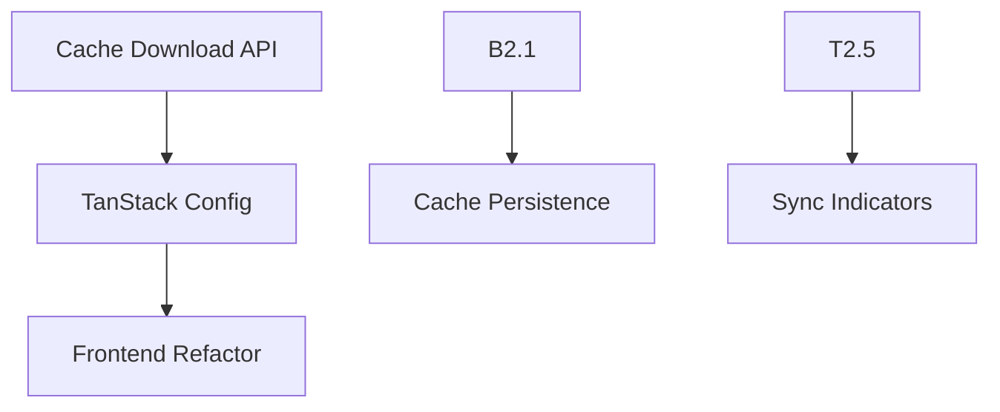

# 🚀 Local-First Contacts MVP Implementation Plan

**Created**: August 19, 2025 at 14:30 UTC  
**Project**: OmniCRM Local-First Contacts MVP  
**Status**: Implementation Planning  
**Team Size**: 3 developers  
**Timeline**: 3-4 weeks

---

## 📋 Simplified Scope

**Target User**: Solopreneurs, coaches, trainers with 100-3000 contacts  
**Focus**: Single-device local-first experience with periodic server sync  
**Timeline**: 3-4 weeks with 3 developers  
**No Multi-Device**: Launch single-device first, add cross-device later

---

## 🎯 Core MVP Features

- ✅ **Local-First**: All contacts cached locally for instant pagination
- ✅ **Scheduled Sync**: 6am/6pm + manual trigger
- ✅ **Optimistic Updates**: Immediate UI updates, sync later
- ✅ **Simple Conflict Resolution**: Latest timestamp wins (last-write-wins)
- ✅ **Clear Naming**: "Contact Cache Sync" vs existing "Google Data Sync"

---

## 👥 MVP Team & Timeline

### **Week 1: Foundation**

#### 🔧 **Backend Dev** _(Priority 1 - Blocks others)_

- [ ] **B1.1** Create `/api/contacts/cache/download` endpoint (full contact dump)
- [ ] **B1.2** Create `/api/contacts/cache/upload` endpoint (accept local changes)
- [ ] **B1.3** Add `updated_at` tracking to contacts table
- [ ] **B1.4** Simple conflict resolution: latest `updated_at` wins
- [ ] **B1.5** Add pageSize=9999 option to bypass current pagination

#### 🎯 **TanStack Expert** _(Parallel with backend)_

- [ ] **T1.1** Design TanStack Query setup for local-first
- [ ] **T1.2** Plan optimistic mutations for create/update/delete
- [ ] **T1.3** Design cache persistence strategy (localStorage for MVP)
- [ ] **T1.4** Plan sync trigger integration points

### **Week 2: Core Implementation**

#### 🔧 **Backend Dev** _(Complete B1.1-B1.5 first)_

- [ ] **B2.1** Implement cache download endpoint with compression
- [ ] **B2.2** Implement cache upload with conflict resolution
- [ ] **B2.3** Add cache sync endpoints to existing cron jobs (6am/6pm)
- [ ] **B2.4** Create manual sync trigger endpoint `/api/contacts/cache/sync`

#### 🎯 **TanStack Expert** _(After B2.1 complete)_

- [ ] **T2.1** Implement cache-first TanStack Query config
- [ ] **T2.2** Create optimistic contact mutations (add/edit/delete)
- [ ] **T2.3** Build cache persistence with localStorage
- [ ] **T2.4** Implement cache hydration on app load
- [ ] **T2.5** Create sync status tracking

#### 💻 **Frontend Dev** _(After T2.1 complete)_

- [ ] **F2.1** Remove server pagination from ContactTable component
- [ ] **F2.2** Implement client-side pagination with all cached data
- [ ] **F2.3** Add "Cache Sync" status indicator to header
- [ ] **F2.4** Create manual "Sync Now" button
- [ ] **F2.5** Update contacts page to use cached data

### **Week 3: Integration & Polish**

#### 💻 **Frontend Dev**

- [ ] **F3.1** Add optimistic updates to all contact actions
- [ ] **F3.2** Implement cache sync loading states
- [ ] **F3.3** Add "Last synced" timestamp display
- [ ] **F3.4** Create simple conflict notification (rare, but possible)
- [ ] **F3.5** Add offline indicator when cache sync fails

#### 🎯 **TanStack Expert**

- [ ] **T3.1** Fine-tune cache policies and expiration
- [ ] **T3.2** Add error handling for failed syncs
- [ ] **T3.3** Implement sync retry logic (3 attempts)
- [ ] **T3.4** Optimize cache size management

#### 🔧 **Backend Dev**

- [ ] **B3.1** Add logging and monitoring for cache sync
- [ ] **B3.2** Performance testing with 3000 contacts
- [ ] **B3.3** Add rate limiting for sync endpoints
- [ ] **B3.4** Create sync health check endpoint

### **Week 4: Final Polish**

#### All Devs (Parallel)

- [ ] **F4.1** User onboarding modal explaining cache sync model
- [ ] **F4.2** Error messaging for sync failures
- [ ] **T4.1** Cache cleanup and garbage collection
- [ ] **B4.1** Performance optimization for large contact lists
- [ ] **F4.3** Polish sync indicators and animations

---

## 🏗️ Simplified Architecture

### **New Components (Minimal)**

```
src/lib/contacts-cache/
├── cache-client.ts        # TanStack Query + localStorage
├── sync-service.ts        # Handles server sync
└── types.ts              # Cache-specific types

src/components/contacts/
├── SyncIndicator.tsx     # Shows "Last synced 2 mins ago"
└── ManualSyncButton.tsx  # "Sync Now" button

Backend:
src/app/api/contacts/cache/
├── download/route.ts     # GET all contacts
├── upload/route.ts       # POST local changes
└── sync/route.ts         # POST manual trigger
```

### **Modified Components**

- **ContactTable**: Remove `getPaginationRowModel()`, use all cached data
- **ContactsPage**: Use `useContactsCache()` instead of server calls
- **Contact CRUD**: Add optimistic updates to create/edit/delete

---

## 🔄 Simplified Sync Flow

### **Initial Load**

```
1. User opens app
2. Check localStorage for cached contacts
3. If cache exists: Show immediately + background sync
4. If no cache: Show loading + download all contacts
5. Store in localStorage + show contacts
```

### **User Actions (Optimistic)**

```
1. User creates/edits contact
2. Update UI immediately (optimistic)
3. Mark change as "pending sync" in localStorage
4. Next sync uploads pending changes
```

### **Scheduled Sync (6am/6pm)**

```
1. Download all contacts from server
2. Merge with pending local changes (latest timestamp wins)
3. Update localStorage
4. Update UI if needed
```

### **Conflict Resolution (Simple)**

```
IF contact edited on server AND locally:
  - Compare updated_at timestamps
  - Keep the latest one
  - Show user notification: "Contact updated during sync"
  - No complex merge UI needed for MVP
```

---

## 📝 Key Naming Conventions

- **Contact Cache Sync** (not "sync" - avoid confusion with Google sync)
- **Cache Download/Upload** (clear distinction from Google data import)
- **Local Contact Storage** (vs Google Drive storage)

---

## ⚡ Performance Targets (MVP)

- [ ] Support 3000 contacts without performance issues
- [ ] Initial page load < 2 seconds (with cache)
- [ ] Pagination < 100ms (client-side)
- [ ] Cache storage < 50MB for 3000 contacts

---

## 🛡️ Simple Security

- [ ] Rate limit sync endpoints (10 requests/minute)
- [ ] Validate user owns contacts before sync
- [ ] Sanitize contact data on upload
- [ ] No local encryption for MVP (add later)

---

## 🚨 Risk Mitigation

1. **Cache Corruption**: Add cache version numbers + clear/rebuild option
2. **Sync Failures**: Retry 3 times + manual sync button
3. **Data Loss**: Always keep server as source of truth
4. **Performance**: Limit initial cache to 5000 contacts max

---

## 💡 User Communication

**Onboarding Message:**

> "We've improved your contact experience! Your contacts are now cached locally for instant access. We'll sync with our servers twice daily (6am/6pm) or when you click 'Sync Now'. If you use multiple devices, the latest changes will be kept during sync."

---

## 🎯 Success Metrics (MVP)

- [ ] Page load time improved by 80%
- [ ] Pagination is instant (< 100ms)
- [ ] Sync success rate > 95%
- [ ] Zero critical bugs in first 2 weeks
- [ ] User feedback score > 4/5

---

## 🛠️ Project Lead Tasks

- [ ] **L1** Review and approve simplified architecture
- [ ] **L2** Coordinate team communication and blockers
- [ ] **L3** Test MVP with realistic data (1000+ contacts)
- [ ] **L4** Create user communication for release
- [ ] **L5** Plan rollback strategy if issues arise
- [ ] **L6** Coordinate deployment and feature flag setup

---

## 🔗 Critical Dependencies



---

## 🧪 Data Flow Example

### **Contact Creation Flow**

```javascript
// 1. User creates contact
const newContact = { name: "John Doe", email: "john@example.com" };

// 2. Optimistic update (immediate UI)
addToCache(newContact, { pending: true });
updateUI(newContact);

// 3. Background sync (next 6am/6pm or manual)
await syncPendingChanges();
// Server assigns real ID, updates timestamp
// Local cache updated with server response
```

### **Cache Structure**

```javascript
localStorage.contactsCache = {
  version: "1.0",
  lastSync: "2025-08-19T14:30:00Z",
  contacts: [...], // Full contact list
  pendingChanges: [...], // Unsync'd local changes
  syncStatus: "synced" | "pending" | "error"
}
```

---

_🎯 This MVP focuses on the core value: instant contact access with periodic sync. No complex multi-device conflicts, no advanced caching, just local-first experience that works for 90% of use cases._

---

**Document Version**: 1.0  
**Last Updated**: August 19, 2025 at 14:30 UTC  
**Next Review**: After Week 1 completion
