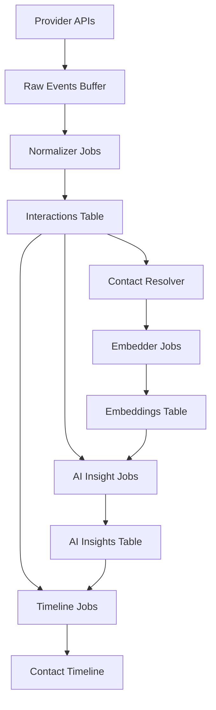

# Universal Ingestion Pipeline

## Overview

The Universal Ingestion Pipeline is a comprehensive data processing system that handles multi-provider data ingestion, normalization, and intelligence generation for the OmniCRM platform.

## Architecture



## Database Changes - Stage 1 (Applied 2025-08-31)

### Migration: `20250831_ingest_hardening.sql`

#### 1. Timezone Standardization

- **All ingestion timestamps converted to `timestamptz`**
- Tables affected: `raw_events`, `interactions`, `ai_insights`, `contact_timeline`, `embeddings`
- **Critical**: All timestamps now stored as UTC, converted in UI layers

#### 2. pgvector Preparation

- **Added `embedding_v` column**: `vector(1536)` dimension standardized
- **Old `embedding` column preserved** for backfill compatibility
- **Next step**: Backfill and swap columns once verified

#### 3. Constraint & Index Cleanup

- **Fixed duplicate foreign keys**: `interactions.contact_id` now has single FK with `ON DELETE SET NULL`
- **Removed duplicate indexes**: `raw_events_user_provider_occurred_idx` dropped
- **Performance**: Cleaner query plans and reduced storage overhead

#### 4. Helper Tables Added

##### `contact_identities` - Multi-Provider Contact Linking

Fast resolution of contacts across providers (Gmail, Instagram, Twilio, etc.)

```sql
-- Example: Link email to contact
INSERT INTO contact_identities (user_id, contact_id, kind, value, provider)
VALUES (user_id, contact_id, 'email', 'sofia@example.com', 'gmail');
```

##### `raw_event_errors` - Dead Letter Queue

Debug ingestion failures without polluting the main event ledger

```sql
-- Example: Log normalization failure
INSERT INTO raw_event_errors (user_id, provider, stage, error, context)
VALUES (user_id, 'gmail', 'normalize', 'Invalid payload format', payload_json);
```

#### 5. Idempotency Features

##### AI Insights Fingerprinting

Prevents duplicate insight generation via SHA256 fingerprint of key fields:

```sql
-- Automatic fingerprint: kind + subject_type + subject_id + model + title
-- Unique constraint prevents duplicate insights
```

##### Embeddings Chunk-Level Deduplication

Prevents re-embedding of identical content chunks:

```sql
-- New fields: content_hash, chunk_index
-- Unique constraint on: user_id + owner_type + owner_id + content_hash + chunk_index
```

#### 6. Row Level Security (RLS)

- **All ingestion tables secured** with user-scoped access
- **Service role policies** allow pipeline workers to write
- **User policies** restrict to own data only
- **Manual note insertion** allowed for UI interactions

#### 7. Performance Indexes

- **JSONB GIN indexes** on `raw_events.payload` and `interactions.body_raw`
- **Fast deep-key queries** for analytics and debugging

## Data Flow Patterns

### Universal Buffer Pattern

All providers write to `raw_events` first, then process through unified pipeline:

1. **Provider → Raw Events**: Webhook/sync writes original payload
2. **Normalizer**: Converts provider format → standard `interactions`
3. **Contact Resolver**: Links interactions to contacts via identities
4. **Embedder**: Chunks text and generates vector embeddings
5. **AI Insights**: Generates summaries, scores, next-best-actions
6. **Timeline Writer**: Creates human-readable timeline events

### Idempotency Guarantees

- **Raw Events**: `(user_id, source, source_id)` unique constraint
- **Interactions**: `(user_id, source, source_id)` unique constraint
- **AI Insights**: SHA256 fingerprint prevents duplicates
- **Embeddings**: Content hash + chunk index prevents re-embedding

### Provider Extension Pattern

Adding new providers (Twilio, WebForms, etc.) only requires:

1. Provider normalizer implementation
2. Registration in orchestrator
3. Contact identity mapping rules

## Security Model

### Row Level Security

- **Users**: Read-only access to own data across all tables
- **Service Role**: Full CRUD access for pipeline operations
- **Manual Notes**: Users can insert `type='note_added'` interactions

### Data Isolation

- All queries automatically filtered by `user_id = auth.uid()`
- No cross-user data leakage possible
- Pipeline workers use service role with full access

## Performance Considerations

### Indexing Strategy

- **Timeline queries**: `(user_id, occurred_at DESC)`
- **Contact lookups**: `(user_id, contact_id, occurred_at DESC)`
- **Provider debugging**: `(user_id, provider, created_at DESC)`
- **Vector search**: pgvector indexes with ivfflat/hnsw

### Retention Policy

- **Raw Events**: 90-180 days (archive to object storage)
- **Interactions**: Permanent (core business data)
- **Embeddings**: Permanent (expensive to regenerate)
- **AI Insights**: 1 year with TTL support

## Current Status

### ✅ Completed (Stage 1)

- Database schema hardened and secured
- Timezone standardization complete
- Helper tables operational
- Idempotency features active
- RLS policies enforced

### 🚧 Next Steps (Stage 2)

- Orchestrator scaffolding
- Provider normalizers
- Contact resolution logic
- Job queue system
- Backfill existing data

## Monitoring & Debugging

### Key Metrics Tables

- `raw_event_errors`: Failed processing attempts
- `jobs`: Queue status and retry counts
- `sync_audit`: Provider sync history

### Debug Queries

```sql
-- Failed ingestion events by provider
SELECT provider, stage, count(*)
FROM raw_event_errors
WHERE error_at > now() - interval '24 hours'
GROUP BY provider, stage;

-- Timeline population rate
SELECT date_trunc('day', created_at), count(*)
FROM contact_timeline
GROUP BY 1 ORDER BY 1 DESC;

-- Embedding coverage
SELECT owner_type, count(*) as chunks
FROM embeddings
GROUP BY owner_type;
```

## Support

For pipeline issues or questions:

1. Check `raw_event_errors` table for specific failures
2. Review `jobs` table for queue processing status
3. Verify RLS policies if access issues occur
4. Monitor embedding dimensions match model expectations (1536)

---

**Last Updated**: 2025-08-31  
**Migration Applied**: `20250831_ingest_hardening.sql`  
**Next Stage**: Orchestrator Implementation
