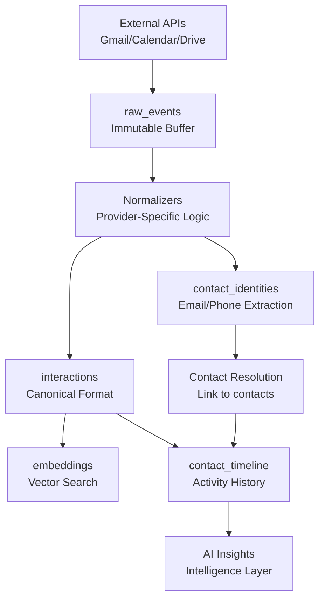

# Universal Ingestion Pipeline Architecture

## Overview

The Universal Ingestion Pipeline is a comprehensive data processing system designed to handle multi-provider data ingestion (Gmail, Google Calendar, future providers) with universal patterns for normalization, contact resolution, and intelligence generation.

**Core Problem Solved**: Despite having 54 calendar events and 495 raw events in the database, the `contact_timeline` table remained empty (0 rows). This pipeline addresses the gap between data ingestion and meaningful contact activity tracking.

## Architecture Principles

1. **Universal Buffer Pattern**: All external data flows through `raw_events` table as immutable audit log
2. **Idempotency Everywhere**: Every processing stage uses conflict resolution to prevent duplicates
3. **Multi-Provider Contact Resolution**: Unified contact linking across Gmail, Calendar, and future providers
4. **Asynchronous Processing**: Background jobs handle heavy lifting without blocking user flows
5. **Type Safety**: Zod schemas validate data at every boundary
6. **Service Separation**: Clear boundaries between ingestion, normalization, and intelligence layers

## Data Flow Architecture



## Core Tables & Responsibilities

### Buffer Layer

- **`raw_events`**: Immutable audit log of all external data
  - Stores original provider payloads
  - Source of truth for replay/backfill operations
  - Never modified after creation

### Processing Layer

- **`contact_identities`**: Email/phone extraction from all providers
  - Enables cross-provider contact resolution
  - Supports fuzzy matching algorithms
  - Unique constraint on (user_id, kind, value, provider)

- **`interactions`**: Canonicalized user activities
  - Normalized format across all providers
  - Idempotent upsert on (user_id, source, source_id)
  - Links to contacts after resolution

### Intelligence Layer

- **`contact_timeline`**: Chronological activity feed per contact
  - Auto-populated from interactions
  - Supports business intelligence queries
  - Timeline-based AI insights

- **`embeddings`**: Vector representations for semantic search
  - Chunked text with overlap handling
  - Deduplication via content hashing
  - Supports similarity queries

## Implementation Stages

### Stage 0: Database Hardening ✅

- **Timezone Standardization**: All timestamps converted to `timestamptz` (UTC)
- **pgvector Preparation**: Added `vector(1536)` column to embeddings table
- **Helper Tables**: Created `contact_identities` for multi-provider resolution
- **RLS Policies**: User/service role separation for security

**Key Files:**

- `migrations/20250831_ingest_hardening.sql` (applied in 4 parts)

### Stage 1: Type Safety Scaffolding ✅

- **Zod Schemas**: Type validation for all data boundaries
- **DTO Interfaces**: Clean interfaces for all processing stages
- **Error Types**: Structured error handling throughout pipeline

**Key Files:**

- `src/lib/schemas/interactions.dto.ts`
- `src/lib/schemas/embeddings.dto.ts`
- `src/lib/schemas/contacts.dto.ts`

### Stage 2: Job Queue Foundation ✅

- **Queue Manager**: Centralized job scheduling and batch processing
- **Job Types**: Normalize, embed, insight generation, timeline creation
- **Batch Processing**: Efficient bulk operations with progress tracking

**Key Files:**

- `src/server/jobs/queue-manager.ts`
- `src/server/jobs/orchestrator.ts`

### Stage 3: Contact Resolution ✅

- **Identity Extraction**: Email/phone parsing from all providers
- **Fuzzy Matching**: Intelligent contact linking algorithms
- **Conflict Resolution**: Handles duplicate contacts across providers

**Key Files:**

- `src/server/jobs/processors/contact-resolver.ts`
- `src/server/storage/contact-identities.repo.ts`

### Stage 4: Real Normalizers ✅

- **Gmail Normalizer**: Base64url decoding, thread handling, attachment processing
- **Calendar Normalizer**: Event parsing, attendee extraction, meeting URL detection
- **Unit Tests**: Comprehensive test coverage for edge cases

**Key Files:**

- `src/server/jobs/processors/gmail-normalizer.ts`
- `src/server/jobs/processors/calendar-normalizer.ts`
- `src/server/jobs/processors/__tests__/` (test files)

### Stage 5: Interaction Storage ✅

- **Repository Pattern**: Clean data access layer with transaction support
- **Idempotent Upserts**: Conflict resolution on (user_id, source, source_id)
- **Embedding Integration**: Automatic text embedding for semantic search

**Key Files:**

- `src/server/storage/interactions.repo.ts`
- `src/server/jobs/processors/embedder.ts`

### Stage 6: Intelligence Generation ✅

- **Timeline Writer**: Auto-generates contact timeline events
- **Insight Writer**: AI-powered contact intelligence
- **Scheduled Processing**: Regular intelligence updates for active contacts

**Key Files:**

- `src/server/jobs/processors/timeline-writer.ts`
- `src/server/jobs/processors/insight-writer.ts`
- `src/server/jobs/scheduled/recent-interactions-processor.ts`

### Stage 7: Backfill & Replay ✅

- **Admin API**: Authenticated endpoint for replay operations
- **Batch Processing**: Configurable batch sizes and provider filtering
- **Dry Run Support**: Preview operations before execution
- **Progress Tracking**: Monitor replay status and statistics

**Key Files:**

- `src/app/api/admin/replay/route.ts`

## Real-World Data Examples

### Gmail Message Processing

```typescript
// Input: Gmail API message with base64url encoding
{
  "id": "18f2...",
  "payload": {
    "parts": [{
      "mimeType": "text/plain",
      "body": { "data": "SGVsbG8gV29ybGQ=" } // base64url
    }]
  }
}

// Output: Canonical interaction
{
  "userId": "user-123",
  "type": "email_received",
  "subject": "Project Update",
  "bodyText": "Hello World", // decoded
  "source": "gmail",
  "sourceId": "18f2..."
}
```

### Calendar Event Processing

```typescript
// Input: Google Calendar event
{
  "summary": "30-minute massage consultation",
  "attendees": [
    { "email": "sofia@example.com", "displayName": "Sofia Martinez" }
  ],
  "conferenceData": {
    "entryPoints": [{ "uri": "https://meet.google.com/abc-123" }]
  }
}

// Output: Interaction + Contact Identity
interaction: {
  "type": "meeting_created",
  "subject": "30-minute massage consultation",
  "sourceMeta": { "meetUrl": "https://meet.google.com/abc-123" }
}

identity: {
  "kind": "email",
  "value": "sofia@example.com",
  "displayName": "Sofia Martinez"
}
```

## Processing Patterns

### Idempotency Implementation

```sql
-- Interactions table upsert
INSERT INTO interactions (user_id, source, source_id, ...)
VALUES (?, ?, ?, ...)
ON CONFLICT (user_id, source, source_id)
DO UPDATE SET
  contact_id = EXCLUDED.contact_id,
  body_text = EXCLUDED.body_text,
  updated_at = now();
```

### Contact Resolution Algorithm

1. **Extract Identities**: Parse emails/phones from all interactions
2. **Fuzzy Matching**: Compare against existing contact identities
3. **Confidence Scoring**: Rate match quality (exact > domain > fuzzy)
4. **Link Interactions**: Bulk update interactions with resolved contact_id
5. **Timeline Generation**: Auto-create timeline events for linked interactions

### Embedding Strategy

```typescript
// Chunking with overlap for context preservation
const chunks = this.chunkText(sourceText, {
  chunkSize: 800,
  chunkOverlap: 100,
  preserveWords: true,
});

// Deduplication via content hashing
const contentHash = crypto.createHash("sha256").update(chunk.trim().toLowerCase()).digest("hex");
```

## API Endpoints

### Admin Replay API

```http
POST /api/admin/replay?provider=gmail,google_calendar&days=30&batchSize=50
Authorization: Bearer <user-token>

# Dry run mode
POST /api/admin/replay?provider=gmail&days=7&dryRun=true

# Check status
GET /api/admin/replay?batchId=batch-123
```

**Parameters:**

- `provider`: Comma-separated list (gmail, google_calendar, twilio)
- `days`: Lookback period (1-90 days)
- `batchSize`: Processing batch size (1-200)
- `dryRun`: Preview mode without execution

## Performance Considerations

### Batch Processing

- **Gmail**: 50-100 messages per batch to avoid rate limits
- **Calendar**: 100-200 events per batch (lighter payload)
- **Embeddings**: 25-50 texts per batch (GPU intensive)

### Database Optimization

```sql
-- Critical indexes for performance
CREATE INDEX contact_identities_user_kind_value_idx
  ON contact_identities(user_id, kind, value);

CREATE INDEX interactions_user_contact_occurred_idx
  ON interactions(user_id, contact_id, occurred_at DESC);

CREATE INDEX raw_events_user_provider_created_idx
  ON raw_events(user_id, provider, created_at DESC);
```

### Memory Management

- **Streaming Processing**: Process large datasets without loading full results
- **Connection Pooling**: Efficient database connection reuse
- **Garbage Collection**: Explicit cleanup of large objects

## Error Handling & Recovery

### Graceful Degradation

```typescript
// Continue processing on individual failures
for (const rawEvent of batch) {
  try {
    await this.processRawEvent(rawEvent);
    processed++;
  } catch (error) {
    errors.push(`Failed to process ${rawEvent.id}: ${error.message}`);
    // Continue with next event
  }
}
```

### Retry Strategies

- **Exponential Backoff**: For rate-limited APIs
- **Dead Letter Queue**: Failed jobs for manual review
- **Circuit Breaker**: Prevent cascade failures

### Monitoring & Observability

```typescript
// Health checks for scheduled processors
async healthCheck(): Promise<{
  status: 'healthy' | 'degraded' | 'unhealthy';
  checks: Record<string, boolean>;
  metrics: Record<string, number>;
}>
```

## Integration Points

### Existing Services

The pipeline integrates with existing Gmail and Calendar services:

1. **Gmail Service** (`src/server/google/gmail.ts`)
   - Maintains OAuth tokens and API calls
   - Pipeline consumes message data for normalization

2. **Calendar Service** (`src/server/services/google-calendar.service.ts`)
   - Handles Google Calendar API integration
   - Pipeline processes event data for contact extraction

3. **Contact Services** (`src/server/repositories/contacts-optimized.repo.ts`)
   - Enhanced with contact resolution capabilities
   - Timeline generation populates contact activity feeds

### Future Extensibility

The architecture supports additional providers:

- **Twilio**: SMS/call log ingestion
- **Slack**: Team communication analysis
- **Zoom**: Meeting transcription and attendee tracking
- **Email Providers**: Outlook, Apple Mail via IMAP

## Deployment & Operations

### Environment Variables

```bash
# Required for pipeline operation
DATABASE_URL=postgresql://...
SUPABASE_SECRET_KEY=...
APP_ENCRYPTION_KEY=... # 32-byte base64
OPENAI_API_KEY=... # For embeddings
```

### Scheduled Jobs

```typescript
// Every 15-30 minutes: Process recent interactions
const processor = new RecentInteractionsProcessor();
await processor.processRecentInteractions();

// Daily: Clean up old raw_events and failed jobs
// Weekly: Generate contact intelligence summaries
```

### Monitoring Commands

```bash
# Check pipeline health
curl -X GET /api/admin/replay

# Replay recent Gmail data
curl -X POST "/api/admin/replay?provider=gmail&days=7&batchSize=25"

# Monitor job queue
npx drizzle-kit studio # Browse jobs table
```

## Success Metrics

### Pipeline Health Indicators

- **Contact Timeline Population**: Target >90% of calendar events linked to timeline
- **Contact Resolution Rate**: Target >80% of interactions linked to contacts
- **Processing Latency**: Target <5 minutes from ingestion to timeline
- **Error Rate**: Target <5% failed jobs per batch

### Business Intelligence Outputs

- **Contact Engagement Scoring**: Frequency and recency of interactions
- **Revenue Attribution**: Link calendar events to business outcomes
- **Client Journey Mapping**: Progression through wellness service tiers
- **Retention Analysis**: Identify at-risk clients before churn

This pipeline transforms raw external data into actionable business intelligence for wellness businesses, providing the foundation for AI-powered client management and growth optimization.
